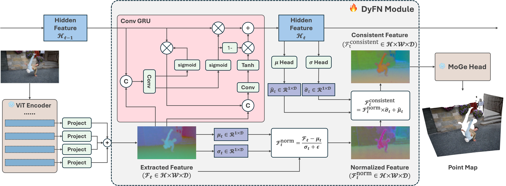

<div align="center">

# Stabilizing Streaming Video Geometry via Dynamic Feature Normalization

<a href="https://arxiv.org/pdf/2605.25308v1"></a>
<a href='https://shawlyu.github.io/DyFN/'></a>

</div>



---

DyFN improves temporal stability for streaming video geometry estimation while preserving competitive depth accuracy across diverse benchmarks.

Project page: [https://shawlyu.github.io/DyFN/](https://shawlyu.github.io/DyFN/)

## 🔬 Empirical Study

Try the interactive latent-statistics sweep in [`jupyter_demo/SingleFrameScaleShift.ipynb`](jupyter_demo/SingleFrameScaleShift.ipynb). It reproduces the paper's empirical study on how feature mean and variance affect depth scale, shift, and accuracy.

## 🛠️ Installation

### Install via pip
  
```bash
pip install git+https://github.com/shawLyu/Streaming_DyFN.git
```

### Or clone this repository locally

```bash
git clone https://github.com/shawLyu/Streaming_DyFN.git
cd Streaming_DyFN
```

Then install dependencies:

```bash
pip install -r requirements.txt
```

DyFN is compatible with a wide range of dependency versions. Check `requirements.txt` if you need strict environment control.

## 🎬 Inference

Run video inference with:

```bash
python moge/scripts/infer_video.py --video_path videos/jump.mp4 --save_video
```

## 🧠 Pretrained Models

Our pretrained models are organized as follows:

| Version | Checkpoint | Base Model | Video Stability | #Params |
| :--- | :--- | :---: | :---: | :---: |
| DyFN | [`shawlyu/DyFN`](https://huggingface.co/shawlyu/DyFN) / `./pretrained/DyFN.pt` | MoGE-based | ✅ | 320M |

> NOTE: More checkpoint variants will be released soon.

## 📊 Evaluation

Detailed evaluation instructions are available in [docs/eval.md](docs/eval.md).

Run baseline video evaluation with:

```bash
python moge/scripts/eval_video_baseline.py --video_dir_path ~/data_disk/dataset/local/depthcrafter/datasets/ --pretrained shawlyu/DyFN
```

### Video Evaluation

| Method | Sintel (50 frames) Abs Rel↓ | Sintel (50 frames) $\delta < 1.25$ ↑ | Scannet (90 frames) Abs Rel↓ | Scannet (90 frames) $\delta < 1.25$ ↑ | KITTI (110 frames) Abs Rel↓ | KITTI (110 frames) $\delta < 1.25$ ↑ | Bonn (110 frames) Abs Rel↓ | Bonn (110 frames) $\delta < 1.25$ ↑ |
| :--- | :---: | :---: | :---: | :---: | :---: | :---: | :---: | :---: |
|  Marigold | 0.532 | 51.5 | 0.166 | 76.9 | 0.149 | 79.6 | 0.091 | 93.1 |
|  DAV1 | 0.325 | 56.4 | 0.130 | 83.8 | 0.142 | 80.3 | 0.078 | 93.9 |
|  DAV2 | 0.367 | 55.4 | 0.135 | 82.2 | 0.140 | 80.4 | 0.106 | 92.1 |
|  MoGe v1 | 0.216 | 65.3 | 0.117 | 84.7 | 0.076 | 96.0 | 0.074 | 95.5 |
|  DepthPro | 0.319 | 52.0 | (0.088) | (92.7) | (0.088) | (92.2) | (0.063) | (96.6) |
|  MoGe v2 | 0.214 | 69.5 | (0.110) | (88.2) | (0.183) | (58.8) | (0.049) | (98.0) |
|  VGGT | 0.287 | 66.1 | 0.031 | 98.5 | 0.070 | 96.5 | 0.055 | 97.1 |
|  Monst3R | 0.335 | 58.5 | 0.123 | 83.2 | 0.104 | 89.5 | 0.063 | 96.4 |
|  CUT3R | 0.421 | 47.9 | 0.097 | 88.7 | 0.118 | 88.1 | 0.078 | 93.7 |
|  TTT3R | 0.404 | 50.0 | 0.114 | 87.7 | 0.113 | 90.4 | 0.068 | 95.4 |
|  DepthCrafter | 0.270 | 69.7 | 0.123 | 85.6 | 0.104 | 89.6 | 0.071 | 97.2 |
|  VDA | 0.300 | 63.3 | 0.075 | 95.4 | 0.079 | 95.0 | 0.051 | 98.1 |
| FlashDepth | 0.265 | 64.2 | 0.101 | 90.3 | 0.103 | 89.5 | 0.053 | 98.0 |
| **Ours** | **0.180** | **73.0** | **0.073** | **96.6** | **0.062** | **97.3** | **0.044** | **98.4** |

> NOTE: Values in parentheses `()` indicate evaluation on raw metric outputs without alignment.

### Image Evaluation

| Method | Sintel Abs Rel ↓ | Sintel $\delta < 1.25$ ↑ | Scannet Abs Rel ↓ | Scannet $\delta < 1.25$ ↑ | KITTI Abs Rel ↓ | KITTI $\delta < 1.25$ ↑ | Bonn Abs Rel ↓ | Bonn $\delta < 1.25$ ↑ |
| :--- | :---: | :---: | :---: | :---: | :---: | :---: | :---: | :---: |
|  DAV2 | 0.200 | 74.1 | 0.039 | 98.2 | 0.073 | 95.3 | 0.048 | 98.0 |
|  MoGe v1 | **0.124** | **83.7** | **0.027** | **98.6** | **0.044** | **98.0** | **0.028** | **98.8** |
|  CUT3R | 0.428 | 55.4 | 0.064 | 93.7 | 0.092 | 91.3 | 0.063 | 96.2 |
|  VDA | 0.200 | 75.3 | 0.041 | 98.1 | 0.074 | 95.1 | 0.039 | 98.6 |
|  FlashDepth | 0.174 | 75.6 | 0.056 | 96.3 | 0.085 | 92.6 | 0.043 | 98.7 |
|  **Ours** | **0.124** | **83.7** | **0.027** | **98.6** | **0.044** | **98.0** | **0.028** | **98.8** |

## 🏋️ Training

Training and finetuning instructions are available in [docs/train.md](docs/train.md).

## 🗂️ Data Processing

Detailed data preparation and processing instructions are available in [docs/train.md](docs/train.md#data-preparation).

## 🤝 Acknowledgement

Our code is built heavily on top of [MoGE](https://github.com/microsoft/MoGe), and the main part of this repository comes from the MoGE codebase.  
We sincerely thank the MoGE authors and contributors for their excellent work and open-source contribution.

## 📖 Citation

If you find this project useful in your research, please cite:

```bibtex
@inproceedings{lyu2026streamingdepth,
  title={Stabilizing Streaming Video Geometry via Dynamic Feature Normalization},
  author={Lyu, Xiaoyang and Liu, Muxin and Wu, Xiaoshan and Wang, Ruicheng and Huang, Yi-Hua and Sun, Yang-Tian and Shi, Shaoshuai and Qi, Xiaojuan},
  booktitle={Proceedings of the IEEE/CVF Conference on Computer Vision and Pattern Recognition (CVPR)},
  year={2026}
}
```

Please also consider citing [MoGE](https://github.com/microsoft/MoGe):

```bibtex
@inproceedings{wang2025moge,
  title={Moge: Unlocking accurate monocular geometry estimation for open-domain images with optimal training supervision},
  author={Wang, Ruicheng and Xu, Sicheng and Dai, Cassie and Xiang, Jianfeng and Deng, Yu and Tong, Xin and Yang, Jiaolong},
  booktitle={Proceedings of the Computer Vision and Pattern Recognition Conference},
  pages={5261--5271},
  year={2025}
}
```